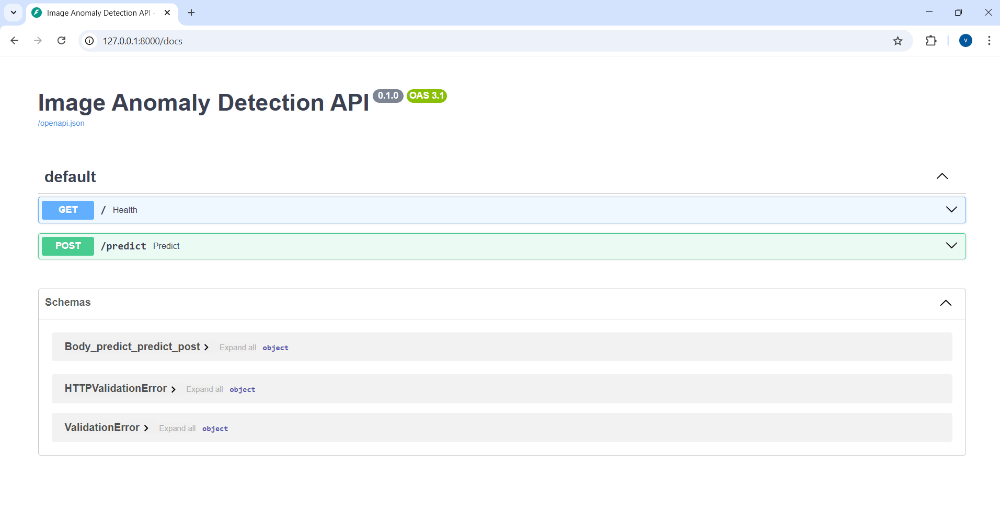

# Image Anomaly Detection API

End-to-end deep learning system for real-time visual anomaly detection in industrial quality-control pipelines, exposed as a FastAPI service.

## Problem Statement

In manufacturing and quality-control pipelines, defects are rare and labeled anomaly data is often unavailable.
This project addresses the problem of detecting anomalous images using only normal samples during training.

## Solution Overview

The system learns a representation of normal images using a pretrained CNN backbone (ResNet).
At inference time, images are scored using embedding distance from the learned normal distribution.

## Architecture

### Training Phase
Normal Images  
→ CNN Feature Extractor (ResNet)  
→ Mean Embedding Computation  
→ Threshold Estimation  

### Inference Phase
Input Image  
→ CNN Feature Extractor  
→ Distance Scoring  
→ Anomaly Decision

## Tech Stack

- Python
- PyTorch
- Torchvision
- NumPy
- FastAPI
- Uvicorn

## Project Structure

image_anomaly_project/
├── artifacts/        # Saved embeddings and threshold
├── data_1/           # Train/test image data
├── src/
│   ├── detector.py   # OOP anomaly detector
│   ├── api.py        # FastAPI service
│   └── validate.py
├── requirements.txt
└── README.md

## How to Run

1. Create and activate a virtual environment
2. Install dependencies:
   pip install -r requirements.txt

3. Start the API server:
   uvicorn src.api:app --reload

4. Open Swagger UI:
   http://127.0.0.1:8000/docs

## Demo

### API Documentation
The FastAPI service exposes interactive API documentation using Swagger UI.

### Example Prediction
Below is an example response returned by the `/predict` endpoint for a sample image.

## API Example

POST /predict

Input:
- Image file (PNG/JPG)

Response:
{
  "anomaly_score": 18.94,
  "threshold": 5.14,
  "is_anomaly": true
}

## Results & Observations

- Achieved low false-positive rate on normal images
- Threshold tuning allows controlling sensitivity vs. missed defects
- Suitable for scenarios where missing defects is more costly than false alarms

## Future Improvements

- Support cosine similarity scoring
- Add batch inference
- Dockerize for cloud deployment
- Add monitoring and logging
